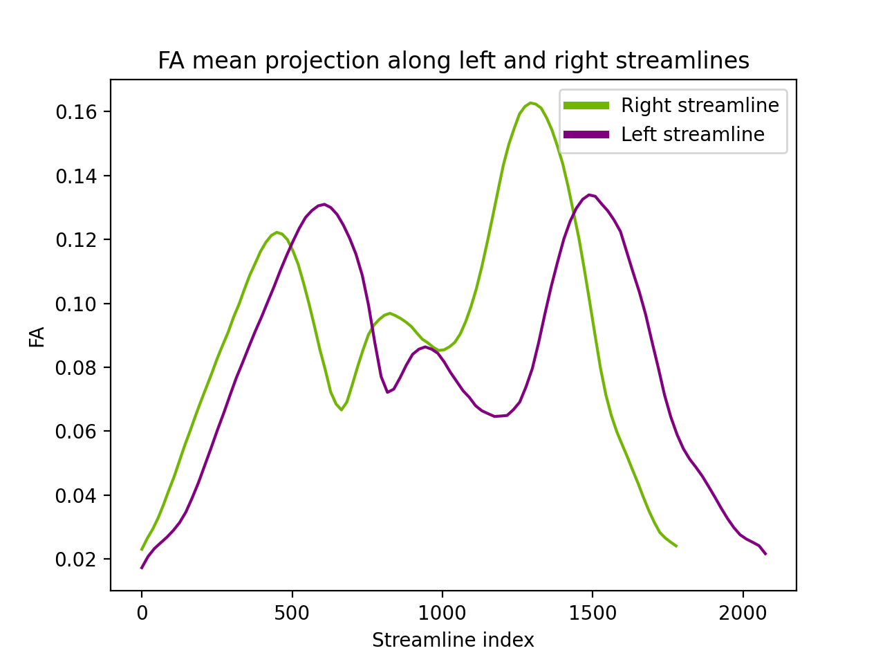
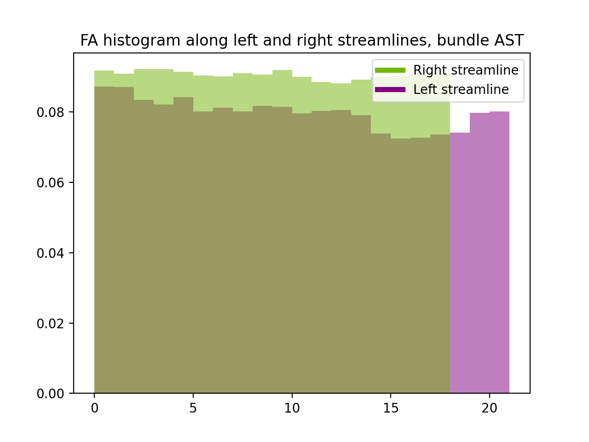
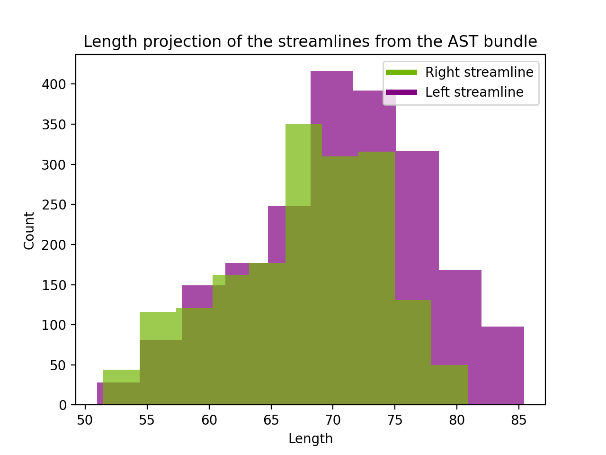
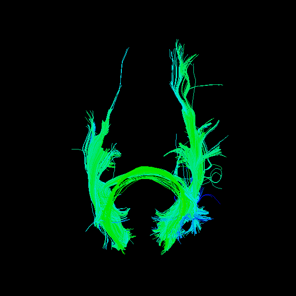
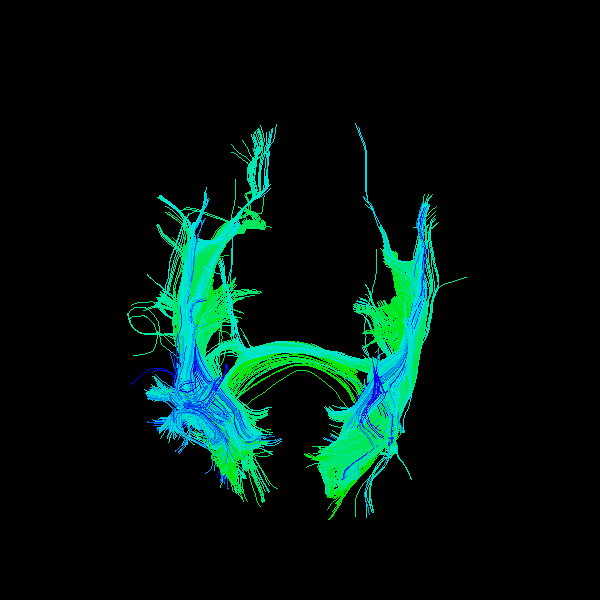
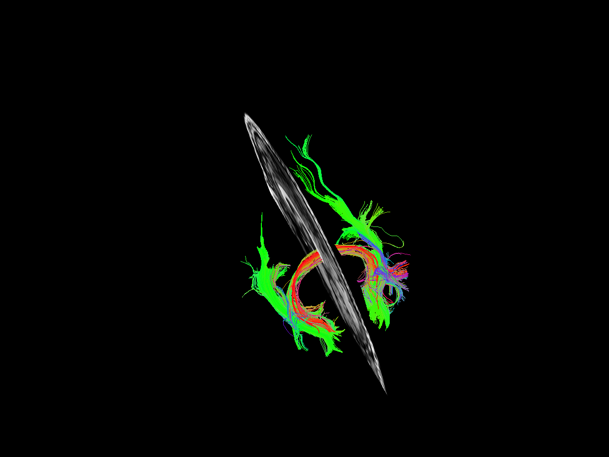

# Diffusion Imaging In Python(Dipy) notes

This repository contains notes/tutorials using dipy library, in python, for d-MRI image processing.

## Genes prediciton
Using 3D d-MRI scans and a convolutional neural network / Streamlines vectors coordinates with a linear model to predict the APOE genes. 

Code coming soon ... 

## Symmetry related features
Script that returns symmetry related features like: shape similarity score, length comparison, and plots like: FA along left and right streamlines, histogram of the FA, length histogram etc.

The script runs by default on HCP842 Atlas, but can be change when running it from CLI.

The symmetry features extracted for AST bundle:
Shape similarity score: 1.0
Total length of the right streamlines: 146418.802[mm]
Total length of the left streamlines: 120262.568 [mm]

Graphs preview for the AST left and right bundle

FA along bundles  |  FA histogram | Length Histogram
-------------------------|:-------------------------:|:-------------------------:
 | | 

## FA values mapped on the streamlines that pass through Calcarine Sulcus ROI
3D demo of the FA values mapped on the streamlines that pass through Calcarine Sulcus ROI.

Top perspective    |  Bottom perspective
-------------------------|:-------------------------:
 | 

## Streamlines visualization
Photo representing all the streamlines passing through the Calcarine Sulcus ROI(left + right).

Calcarine Sulcus ROI 1st perspective     |  Calcarine Sulcus ROI 2nd perspective
-------------------------|:-------------------------:
  |  
